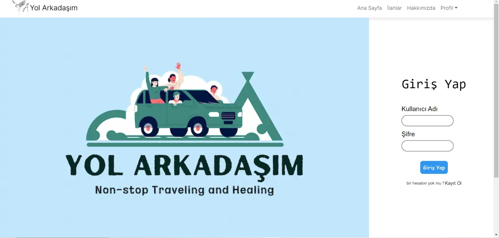
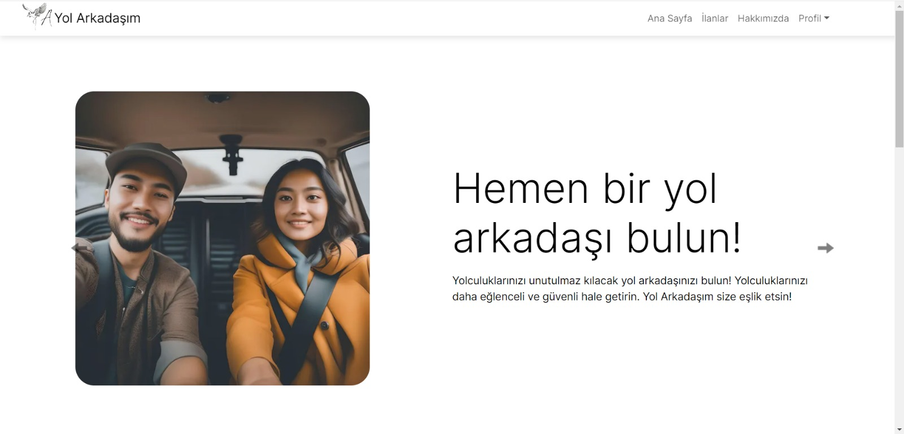
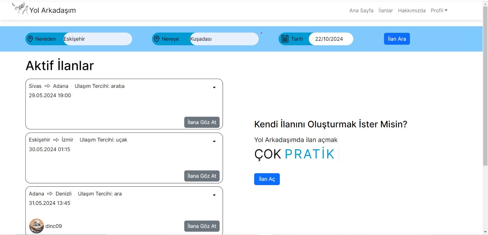
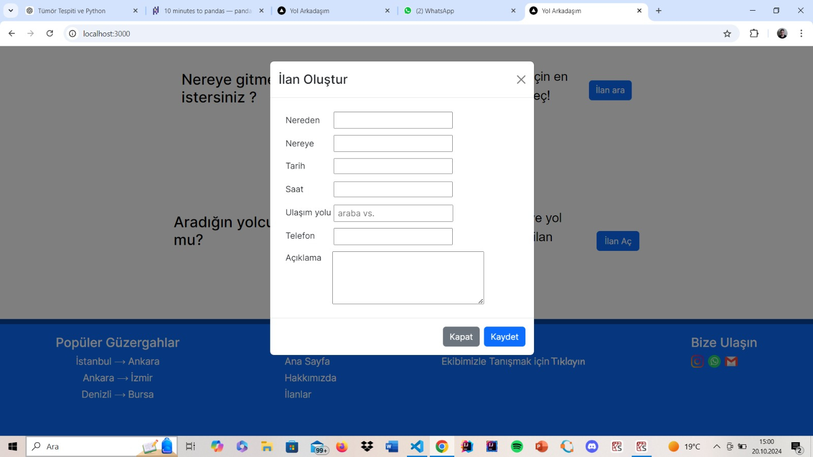
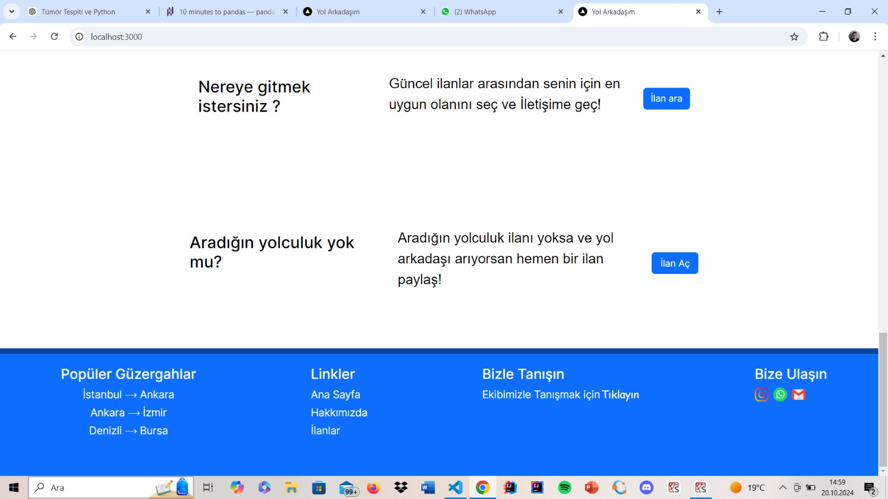

# Yol-Arkadasim-Golang

Yol-Arkadasim is a platform inspired by BlaBlaCar, designed to help users find travel companions for both city and intercity trips. This project is built using modern technologies like **Next.js**, **TailwindCSS**, **MongoDB**, **Go**, **Gin**, and **Axios**.

The application allows drivers to share empty seats in their vehicles and passengers to reserve these seats for their journeys. Users can create ads for the routes they plan to travel or apply to existing ads.

## Technologies

- **Next.js**: A modern frontend framework based on React.
- **TailwindCSS**: Used for fast and flexible CSS design.
- **MongoDB**: NoSQL database for managing data.
- **Go**: Used to build the backend API.
- **Gin**: A lightweight HTTP web framework for Go.
- **Axios**: Used for data exchange between frontend and backend.

## Setup and Usage

To run this project locally, follow these steps:

1. Clone the repository:

   ```bash
   git clone https://github.com/oguzhankuzulukluoglu/Yol-Arkadasim.git
   cd Yol-Arkadasim
Install dependencies for both frontend and backend in one go:

For the frontend:

bash
Kodu kopyala
cd client/yol-arkadasim
npm install
npm run dev
For the backend:

bash
Kodu kopyala
cd server
go mod tidy
go run main.go
Create the .env file:

In the project root directory, create a .env file and configure the following environment variables:

bash
Kodu kopyala
MONGO_URI=your_mongodb_uri
PORT=5000
Run the application:

To start the frontend:

bash
Kodu kopyala
npm run dev
To start the backend:

bash
Kodu kopyala
go run main.go








